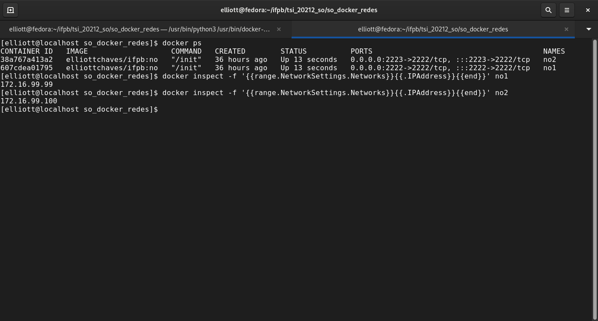
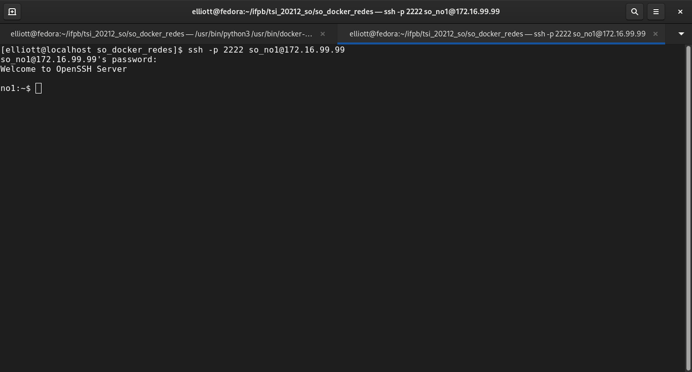
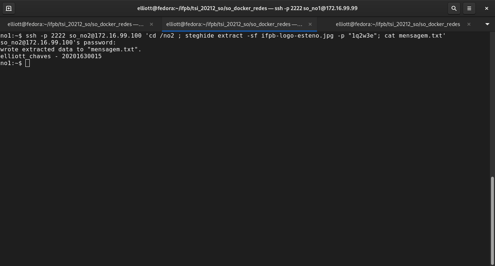

# Tarefas de redes utilizando Docker

- [Introdução](#introdução)
- [Primeiros passos](#primeiros-passos)  
  - [docker-compose](#docker-compose)
    - [Configurando os serviços](#configurando-os-servios)
  - [Corrigindo permissões](#corrigindo-permisses)
- [Atividade](#atividade)
  - [Acesso aos containers pelo terminal](#acesso-aos-containers-pelo-terminal)
- [O que entregar?](#o-que-entregar)

## Introdução

---

Este repositório tem por objetivo passar orientações sobre a atividade, onde são realizadas tarefas rotineiras de acesso
a servidores remotamente.


### Primeiros passos

Para que seja possível realizar a atividade, se torna necessário que o computador esteja com o Docker instalado. 
Para mais informações, veja os seguintes endereços:

- [Ubuntu 18.04](https://www.hostinger.com.br/tutoriais/install-docker-ubuntu)
- [Windows](https://balta.io/blog/docker-instalacao-configuracao-e-primeiros-passos)

#### docker-compose

Além do Docker, é necessário a instalação do docker-compose. Para tanto, visite os endereços a seguir:

- [Linux/Ubuntu](https://www.digitalocean.com/community/tutorials/how-to-install-and-use-docker-compose-on-ubuntu-20-04-pt)
- [Windows](https://docs.microsoft.com/pt-br/visualstudio/docker/tutorials/use-docker-compose)
- [Oficial-Inglês](https://docs.docker.com/compose/install/)

##### Configurando os serviços

Para que seja possível a configuração do serviço, baixe o arquivo docker-composer.yml presente neste repositório ou 
clone utilizando a ferramenta git, com o comando a seguir:

```sh
$ git clone https://github.com/elliottchaves/so_docker_redes.git
```

Caso utilizado o git, é necessário acessar a pasta, utilizando o comando cd:

```sh
$ cd so_docker_redes/
```

Com isso, basta apenas executar o docker-compose na pasta:

```sh
$ docker-compose up
```

Ao final da execução, será exibido no terminal uma tela similar a esta:


### Corrigindo permissões

Devido à imagem do Docker ser executado em modo de root, é necessário realizar uma correção nas pastas onde ficaram
os arquivos que serão utilizados na atividade. Para tanto, abra um novo terminal, utilizando o comando CTRL + SHIFT + T,
e execute o seguinte comando:

```sh
$ sudo chown $USER:USER no*/
```

## Atividade

---

### Acesso aos containers pelo terminal

A primeira parte da atividade é listar se os containers foram corretamente criados. Para tanto, execute o seguinte
comando no terminal:

```sh
$ docker ps
```

O comando retornará os containers em execução, bem como os seus identificadores, definidos pelo cabeçalho 'CONTEINER ID'.  

A imagem será semelhante à apresentada abaixo:


De forma de conhecer os IPs associados aos containers, execute o seguinte comando, substituindo NO_AQUI, pelos nomes dos
nós criados, ou seja, **no1** e **no2**:

docker inspect -f '{{range.NetworkSettings.Networks}}{{.IPAddress}}{{end}}' **NO_AQUI**

Com a execução do comando, para ambos os nós, será exibida uma saída similar a esta:



Conhecendo os IPs dos containers, realize o acesso ao **no1** com o seguinte comando:

```sh
ssh -p 2222 so_no1@172.16.99.99

```

Quando solicitado a senha, insira a seguinte:

>**so_no1**

Caso consiga realizar o login, será exibida a seguinte tela:



>**Entrega 1: A saída do comando será um dos itens enviados na atividade. Guarde a captura de tela.**  

Para a continuação da atividade, transfira a imagem do servidor remoto para o container com o comando a seguir:

```sh
$ wget -c http://elliottchaves.tk/ifpb-logo.jpg
```

De posse da imagem, será realizado um processo chamado de esteganografia ([Mais informações](http://www.bosontreinamentos.com.br/seguranca/steghide-esteganografia-no-linux-esconder-dados-em-imagens-e-outros-arquivos/)).  

Neste processo, é possível inserir informações no conteúdo da imagem sem que isso altere de forma percetível ao usuário.
Para criar a mensagem que será 'escondida' na imagem, execute o comando a seguir, substituido o **$NOME** por seu nome e
**$MAT** com a sua matrícula.

```sh
$ echo "$NOME - $MAT" > mensagem.txt
```

Agora, execute o seguinte comando para incluir o conteúdo na imagem transferida anteriormente, substituindo a *$SENHA_USADA por
por uma de interesse, a qual irá criptografar a mensagem:

```sh
$ steghide embed -cf ifpb-logo.jpg -ef mensagem.txt -sf ifpb-logo-mensagem.jpg -p $SENHA_USADA
```

**Não esqueça da senha utilizada!!!**. Esta será necessária numa etapa posterior.

Agora, realize a transferência para o **no2**. Para tanto, execute o comando a seguir:

```sh
$ scp ifpb-logo-mensagem.jpg so_no2@172.16.99.100:/no2/
```

Ao ser solicitada a senha, utilize a seguinte:

>**so_no2**

Para verificar se a imagem foi realmente transferida, execute o comando a seguir, substituindo o parâmetro **$SENHA_USADA**
pela senha definida anteriormente:

```sh
$ ssh -p 2222 so_no2@172.16.99.100 'cd /no2 ; steghide extract -sf ifpb-logo-mensagem.jpg -p "$SENHA_USADA"; cat mensagem.txt'
```

Será solicitada a senha de acesso ao **no2**, utilize a seguinte:

>**so_no2*

Ao fim da execução do comando será exibido o resultado semelhante ao que se segue:



>**Entrega 2: A saída do comando será um dos itens enviados na atividade. Guarde a captura de tela.**

---
# O que entregar?

**Anexe as capturas de telas das Entregas 1 e 2 na atividade do Google Sala de Aula.**


