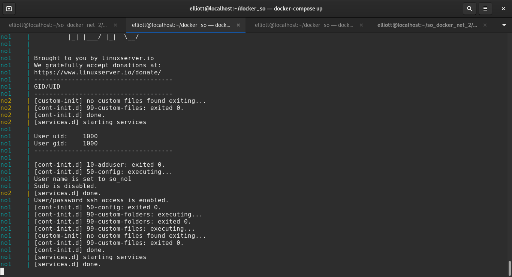
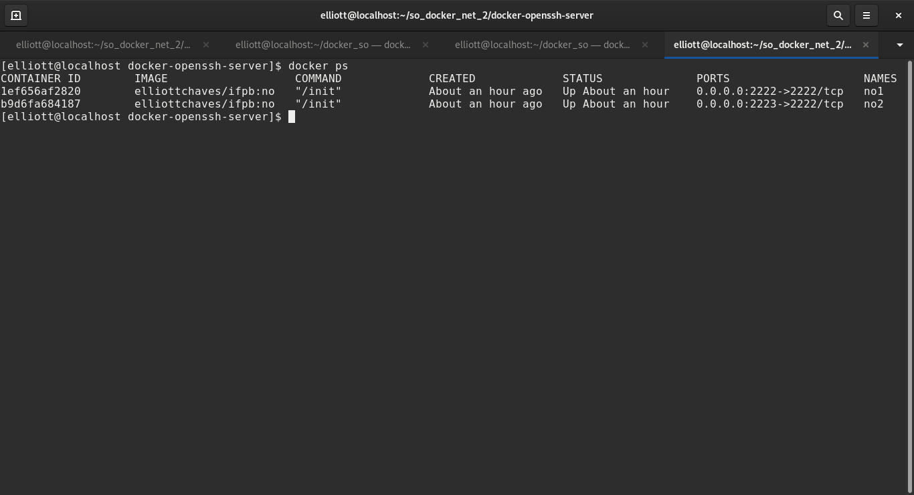
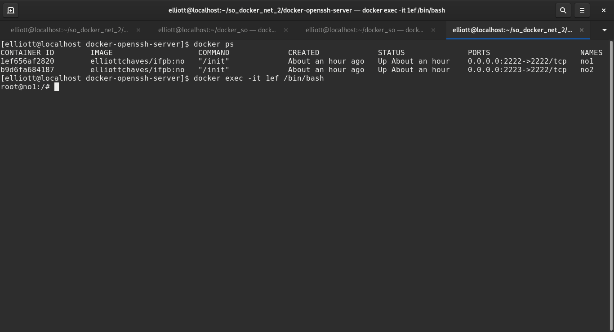
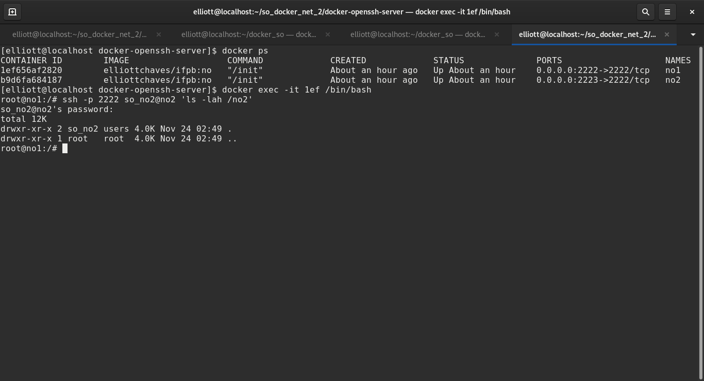

# Tarefas de redes utilizando Docker

- [Introdução](#introducao)
- [Primeiros passos](#primeiros)  
  - [docker-compose](#compose)
    - [Configurando os serviços](#compose-install)
  - [Corrigindo permissões](#fixperm)
- [Atividade](#atividade)
  - [Acesso aos conteiners pelo terminal](#conaccess)

## Introdução

---

Este repositório tem por objetivo passar orientações sobre a atividade, onde são realizadas tarefas rotineiras de acesso
a servidores de forma remota.


### Primeiros passos

Para que seja possível realizar a atividade, é necessário que o computador esteja com o Docker instalado. 
Para mais informações, veja os seguintes sites:

- [Ubuntu 18.04](https://www.hostinger.com.br/tutoriais/install-docker-ubuntu)
- [Windows](https://balta.io/blog/docker-instalacao-configuracao-e-primeiros-passos)

#### docker-compose

Além do Docker, é necessário a instalação do docker-compose. Para tanto, visite os links a seguir:

- [Linux/Ubuntu](https://www.digitalocean.com/community/tutorials/how-to-install-and-use-docker-compose-on-ubuntu-20-04-pt)
- [Windows](https://docs.microsoft.com/pt-br/visualstudio/docker/tutorials/use-docker-compose)
- [Oficial-Inglês](https://docs.docker.com/compose/install/)

##### Configurando os serviços

Para que seja possível a configuração do serviço, baixe o arquivo docker-composer.yml presente neste repositório ou 
clone utilizando a ferramenta git, com o comando a seguir:

```sh
$ git clone https://github.com/elliottchaves/so_docker_redes.git
```

Caso utilizado o git, é necessário acessar a pasta, utilizando o comando cd:

```sh
$ cd so_docker_redes/
```

Com isso, basta apenas executar o docker-compose na pasta:

```sh
$ docker-compose up
```

Ao final da execução, será exbido no console uma tela similar a esta:



### Corrigindo permissões

Devido à imagem do Docker ser executado em modo de root, é necessário realizar uma correção nas pastas onde ficaram
os arquivos que serão utilizados na atividade. Para tanto, abra um novo terminal, utilizando o comando CTRL + SHIFT + T,
e execute o seguinte comando:

```sh
$ sudo chown $USER:USER no*/
```

## Atividade

---

### Acesso aos contêiners pelo terminal

A primeira parte da atividade é listar se os contêiners foram corretamente criados. Para tanto, execute o seguinte
comando no terminal:

```sh
$ docker ps
```

O comando retornará os contêiners em execução, bem como os seus identificadores, definidos pelo cabeçalho 'CONTEINER ID'.
A imagen será semelhante a apresentada abaixo:



Esta saída será um dos itens enviados na atividade. Guarde uma captura de tela. De posse dos IDs, execute o seguinte comando,
substituindo o ID do contêiner do <strong>NO 1</strong> pelo apresentado na saída do seu comando:

```sh
$ docker exec -it 1ef656af2820 /bin/bash
```

Caso obtenha sucesso com a execução do comando, a tela ficará semelhante a esta:



Com isso, execute o seguinte comando para recuperar a lista de arquivos do <strong>$HOME</strong> do <strong>NO 2 </strong>:

```sh
$ ssh -p 2222 so_no2@no2 'ls -lah /no2'
```

Se solicitado senha, utilize:

> <strong> so_no2 </strong>

Sera retornado uma estrutura similiar a esta:


